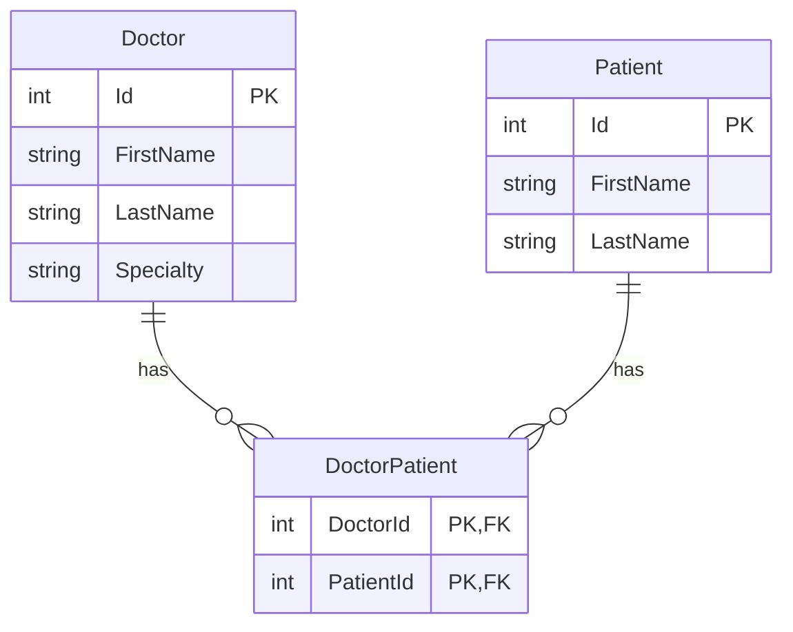

# CareLink.WebApi

A minimal, modern .NET 9 Web API for managing Doctors, Patients, and their many-to-many relationships. The API follows clean layering with Repositories and Services, uses Entity Framework Core 9 with SQL Server, and exposes OpenAPI in development.

## Features

- Minimal APIs with endpoint groups for doctors and patients
- CRUD for Doctors and Patients
- Link/Unlink Patients to Doctors (many-to-many)
- Consistent response via `ApiResponseHelper`
- EF Core 9 with SQL Server
- Unit and integration tests (xUnit, FluentAssertions, Moq, EFCore.Sqlite in-memory for repo tests)

## Tech stack

- .NET 9, C# 13
- ASP.NET Core Minimal APIs
- EF Core 9 (SqlServer)
- Microsoft.AspNetCore.OpenApi
- xUnit, FluentAssertions, Moq (in the test project)

## Project structure

- `CareLink.WebApi/`
  - `Program.cs` – endpoint mapping and DI configuration
  - `Data/`
    - `CareLinkDbContext.cs` – EF Core DbContext
  - `Models/` – domain entities (`Doctor`, `Patient`, `DoctorPatient`)
  - `Repositories/` – repository interfaces and implementations
  - `Services/` – service interfaces and implementations
  - `Helpers/` – `ApiResponseHelper`, `BasicModelValidator`
  - `Migrations/` – EF migrations
  - `appsettings.json`, `appsettings.Development.json` – configuration
  - `CareLink.WebApi.csproj`
- `CareLink.WebApi.Tests/`
  - `Repositories/`, `Services/`
  - `TestUtilities/` – `TestDbFactory`, `RepositoryTestBase` (Sqlite in-memory)

## Entity Relationship Diagram (ERD)



The `DoctorPatient` join table models the many-to-many relationship with a composite primary key `(DoctorId, PatientId)`.

## Getting started

- Prerequisites:
  - .NET 9 SDK
  - SQL Server (localdb or a reachable SQL Server instance)

- Clone and restore
  ```bash
  git clone https://github.com/250908-NET/TrangayC
  cd Projects/CareLink/CareLink.WebApi
  dotnet restore
  ```

- Configure connection string
  - The app reads `ConnectionStrings:Default` from configuration (see `Program.cs`).
  - Recommended for local dev: use User Secrets.
    ```bash
    dotnet user-secrets init
    dotnet user-secrets set "ConnectionStrings:Default" "Server=(localdb)\\MSSQLLocalDB;Database=CareLinkDb;Trusted_Connection=True;MultipleActiveResultSets=true;TrustServerCertificate=true"
    ```
  - Alternatively, set in `appsettings.Development.json` or environment variables.
  - A `connection_string.env` file exists in the project; you can manage your connection string there if you wire it up via a custom configuration provider. By default, the app uses standard ASP.NET Core configuration (appsettings, env vars, user-secrets).

- Apply migrations (if DB is new)
  ```bash
  dotnet tool install --global dotnet-ef
  dotnet ef database update
  ```

- Run the API
  ```bash
  dotnet run
  ```
  The API will listen on the configured URLs (check console output).

## OpenAPI (development)

- In development, the OpenAPI spec is exposed:
  - `GET /openapi/v1.json`
- You can use external tools (e.g. Swagger UI, Scalar, Postman) to import that JSON.

## API overview

Base routes:
- Doctors: `/api/doctors`
- Patients: `/api/patients`

Common response shape (via `ApiResponseHelper`):
- Success: `{ "success": true, "data": <payload>, "message": "..." }`
- Error: `{ "success": false, "errors": [ "..." ], "message": "..." }`

### Doctors

- `GET /api/doctors` – list all doctors (with patients)
- `GET /api/doctors/{id}` – get doctor by Id
- `POST /api/doctors` – create doctor
  - Body:
    ```json
    {
      "firstName": "Greg",
      "lastName": "House",
      "specialty": "Heart"
    }
    ```
- `DELETE /api/doctors/{id}` – delete doctor by Id
- `POST /api/doctors/{doctorId}/patients/{patientId}` – link patient to doctor
- `DELETE /api/doctors/{doctorId}/patients/{patientId}` – unlink patient from doctor

### Patients

- `GET /api/patients` – list all patients (with doctors)
- `GET /api/patients/{id}` – get patient by Id
- `POST /api/patients` – create patient
  - Body:
    ```json
    {
      "firstName": "Jane",
      "lastName": "Doe"
    }
    ```
- `DELETE /api/patients/{id}` – delete patient by Id
- `POST /api/patients/{patientId}/doctors/{doctorId}` – link doctor to patient
- `DELETE /api/patients/{patientId}/doctors/{doctorId}` – unlink doctor from patient

## Validation

- The API uses `BasicModelValidator` for simple checks when creating entities.
- On validation failure, a 400 is returned with the standardized error response.

## Architecture

- Repositories (`Repositories/`) encapsulate data access and are registered in DI:
  - `IDoctorRepository`, `IPatientRepository`, `IDoctorPatientRepository`
- Services (`Services/`) contain business logic and are registered in DI:
  - `IDoctorService`, `IPatientService`, `IDoctorPatientService`
- Minimal endpoints wired in `Program.cs` call these services via DI.

## Database and migrations

- Default provider: SQL Server (`Microsoft.EntityFrameworkCore.SqlServer`).
- Manage schema with EF Core migrations:
  ```bash
  # from the solution root or project folder
  dotnet ef migrations add <Name> -p CareLink.WebApi -s CareLink.WebApi -o Migrations
  dotnet ef database update -p CareLink.WebApi -s CareLink.WebApi
  ```

## Testing

- Project: `CareLink.WebApi.Tests`
- Run: `dotnet test`
- Repository tests use Sqlite in-memory (`RepositoryTestBase` + `TestDbFactory`).
- Unit tests leverage xUnit, FluentAssertions, and Moq.

## Configuration

- App reads usual ASP.NET Core configuration sources in this order:
  - `appsettings.json`, `appsettings.{Environment}.json`
  - User Secrets (development)
  - Environment variables
- Required:
  - `ConnectionStrings:Default` – a valid SQL Server connection string

## Roadmap 
- Add logging/observability (Serilog, OpenTelemetry)

